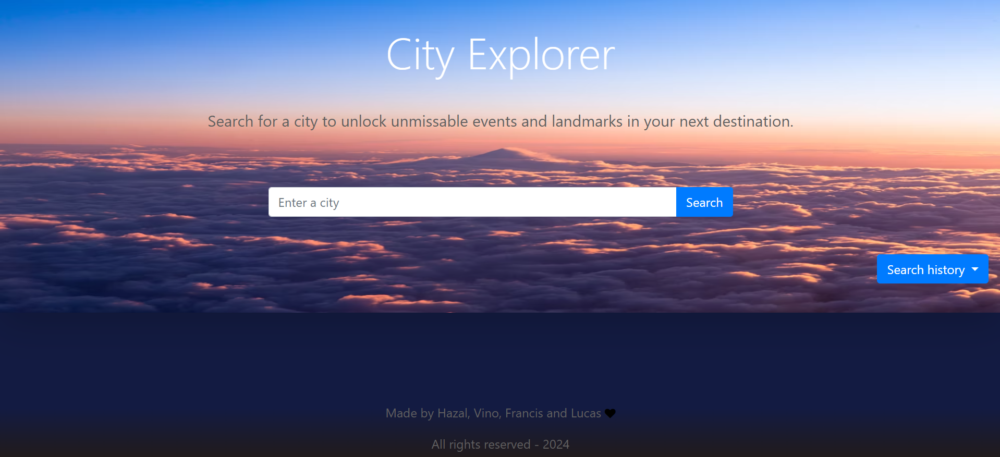
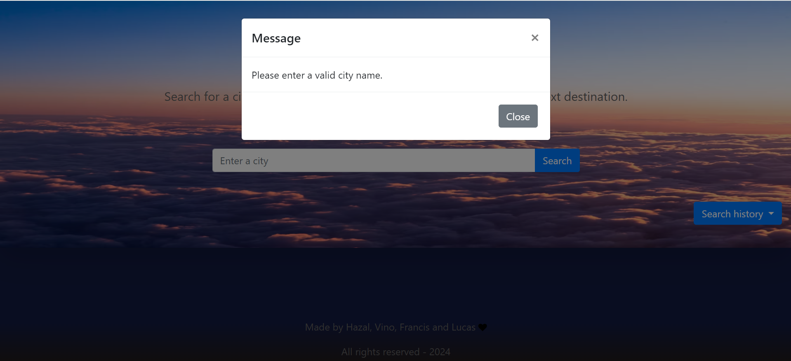
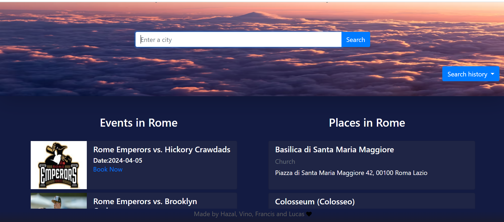
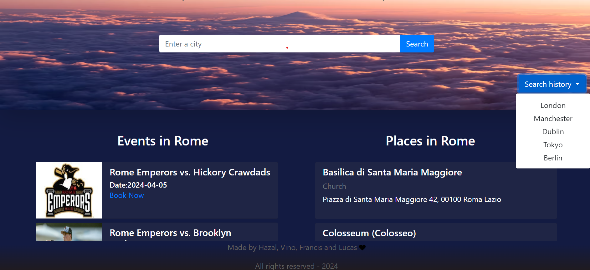

# project-1: City Explorer

## Description

Our application offers a seamless experience for discovering events and places based on city names inputted into the search box. Leveraging the power of two APIs, we fetch comprehensive information about events and places within the specified city. This dynamic integration allows users to explore a diverse array of activities and destinations tailored to their preferences and interests.

Furthermore, to enhance user convenience and facilitate revisits, we've incorporated a local storage feature. Every time a user inputs information, such as a city name, it is securely stored locally within their device. This ensures that their search history remains accessible for future reference without the need for repeated manual entry. With just a click of a button, users can effortlessly access their search history directly from the user interface. This functionality not only streamlines the navigation process but also promotes a personalised experience, enabling users to revisit previous searches and continue their exploration seamlessly.

Whether users are seeking exciting events or intriguing places to visit, our application empowers them with the tools to effortlessly discover and rediscover the world around them, all within a single, intuitive interface.

## Table of Contents

-   [Usage](#usage)
-   [Demo](#demo)
-   [screenshots](#screenshots)
-   [Credits](#credits)

## Usage

You can view the website via this link: [City Explorer](https://hazalsigic.github.io/project-1/)

Git hub repository link: [Project1-CityExplorer](https://github.com/hazalsigic/project-1)

## Demo:

 
 
 - When the user enters city name he wants to explore, user is displayed with places to visit in the city and events happening in the city.
 - When the user gives no city name and click on search button user is displayed with message to enter city name.
 - When the user choose particular event and clicks book now, user will be redirected to TicketMaster webpage to book tickets.
 - When the user clicks on the search history user is displayed with list of city names that user searched previously .
 - User can simply choose the cityname from the search history list instead of typing again and user will be displayed with  city events and place details as per user choice.

  
## Screenshots
###  Lannding Page
-   
### ErrorMessage when user clicks search button without input
-   
### Displaying Data as per user input
-   
### Dispalying data from localstorage
-   

## Contributors:

-   Hazal Sigic
-   Vinothini Santhosh
-   Francis Gomes-Okoye
-   Lucas Prates

### List of third-party assets and References used:

-   [Foursquare APIS](https://location.foursquare.com/developer/)
-   [Ticket Master](https://developer.ticketmaster.com/)
-   [bootstrap ](https://getbootstrap.com/docs/5.0/getting-started/introduction/)
-   [jquery](https://ajax.googleapis.com/ajax/libs/jquery/3.6.0/jquery.min.js)

-   [Refrence used to create custom find method](https://developer.mozilla.org/en-US/docs/Web/JavaScript/Reference/Global_Objects/Array/find#find_an_object_in_an_array_by_one_of_its_properties)
-   [DropDown](https://www.w3schools.com/bootstrap4/bootstrap_dropdowns.asp)
-   [Using fetch](https://developer.mozilla.org/en-US/docs/Web/API/Fetch_API/Using_Fetch)

